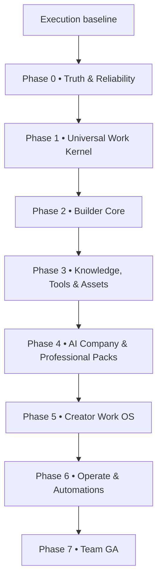

# A.L.F.R.E.D. v4 — Phasewise Development Execution Plan

**Plan type:** additive implementation plan after the currently developed repository baseline  
**Canonical scope authority:** A.L.F.R.E.D. v4 + ANNEX A  
**Prepared:** 2026-08-01  
**Product name:** A.L.F.R.E.D. — Agentic Logic Framework for Real-time Execution and Deployment

## 1. Outcome

This plan converts the current advanced MVP into the **A.L.F.R.E.D. v4 Governed Universal AI Work OS** without rewriting the working foundation.

The execution model is:

- **6 release gates:** R0 through R5;
- **8 canonical v4 build phases:** Phase 0 through Phase 7;
- **77 small, mergeable product micro-phases**, plus four non-product baseline gates (**81 total execution slices**);
- no calendar commitment until v4 §28 capacity data is supplied;
- no new capability, requirement ID, or durable object beyond v4;
- every implementation issue must link to one or more of the existing 181 literal requirement IDs through Annex A8.

## 2. Evidence boundary and current baseline

### 2.1 What is verified from the supplied repository snapshot

The latest supplied code-derived architecture snapshot is dated **2026-06-06**. It verifies a reusable modular-monolith foundation:

| Area | Current verified state |
|---|---|
| Web | Next.js 14 App Router, React 18, TypeScript, Zustand, Tailwind, React Flow, Recharts |
| API | NestJS 10 on Fastify, Zod validation, structured response/error envelopes |
| Data | MongoDB 7 with user/workspace-scoped repositories and indexed collections |
| Queue/runtime | Redis 7 + BullMQ; sequential workflow execution; fixed run lock; asynchronous worker |
| Execution | DSL v1, requirement snapshot, critic/resolver loop, bounded iterations, checkpoint reuse |
| AI providers | Mock, OpenAI, Anthropic, Gemini, Ollama, custom OpenAI-compatible routing |
| Product paths | Auth, workspaces, projects, requirement contracts, project memory, chats, compare, workflows/runs, artifacts, usage, prompts, models/providers |
| Governance foundation | Approval records, audit logs, requirement drift, critique issues, immutable artifact versions |
| Tests | Unit, HTTP E2E, multi-user isolation, workspace isolation, Playwright mock/API smoke |

Source: `PROJECT_ARCHITECTURE.md`, especially §§1–19.

### 2.2 What is partial, risky, or missing in that baseline

| Status | Evidence-backed gap |
|---|---|
| Incorrect/risky | Real provider cost is returned as zero; token estimation is weak; mock can globally override real routing. |
| Incorrect/risky | Browser stores tokens locally and does not automatically refresh after 401. |
| Incorrect/risky | Several resources remain user-scoped instead of workspace-scoped. |
| Incorrect/risky | Realtime publication is in-process; frontend falls back to polling; multi-instance delivery is not safe. |
| Incorrect/risky | Worker lock has fixed expiry without heartbeat; one attempt; no complete DLQ/reconciler/operator replay. |
| Partial | Pause/stop is observed between nodes, not as reliable in-flight provider cancellation. |
| Partial | Approvals and audit have backend APIs but no complete Inbox/operate surface. |
| Partial | Billing, account editing, some chat organization, dashboard and usage remain mock/local. |
| Deprecated | Legacy `agent-nodes` CRUD duplicates the canonical workflow DSL. |
| Missing | Bounded Authority Grant primitive and durable seven-state Effect primitive. |
| Missing | Mission/WorkContract/FlowVersion kernel, typed change materiality, successor Runs, permissive overlays, validated ArtifactVersion carry-forward. |
| Missing | Knowledge ingestion/RAG, safe tools, object storage, vector retrieval, isolated browser/code/render workers. |
| Missing | Versioned Agent Builder, evaluations, Work Packs, mission-specific AI Company, creator pipeline, persistent automations, team RBAC/billing/GA. |

### 2.3 Conflicting legacy documents

The supplied `architecture.md`, `deployment.md`, `README.md`, `database.md`, and `api.md` describe a different Vite/Express/SQLite/t3.micro implementation. They conflict with the verified Next.js/NestJS/MongoDB/Redis repository snapshot and with v4 §10. They must be archived or clearly labeled as superseded during Phase 0.1; they must not drive new code.

### 2.4 Current verification blocker

**BLOCKED — exact current GitHub repository, default branch, commit SHA, and post-2026-06-06 changes were not supplied in this turn.**

Therefore, E0 must compare the actual branch with this baseline before any upgrade PR. The plan is dependency-valid, but the exact “already built” inventory must be refreshed from the real repository.

## 3. Non-negotiable execution rules

1. **Keep the modular monolith.** Retain Next.js + NestJS/Fastify + MongoDB + Redis/BullMQ. Extract only isolated code/browser/render workers where v4 requires a security or workload boundary.
2. **Do not rewrite the orchestrator.** Evolve the existing engine behind versioned contracts and compatibility tests.
3. **`FlowVersion` is the only executable definition.** Agents, Work Packs, Organizations, Plans, Skills, and Tools compile into or bind to it; they do not become competing runtimes.
4. **R0 blocks all breadth.** No new domain pillar starts before truth, tenant scope, Authority Grants, Effects, recovery, mock labeling, and cost accuracy pass.
5. **One micro-phase = one reviewable concern.** A micro-phase may require a short PR chain, but must have one measurable exit result.
6. **Migrations use expand → dual-read/write → backfill → verify → cutover → contract.** Never perform a blind destructive schema switch.
7. **External actions are deny-by-default.** No connector/tool/provider convenience path may bypass Authority Grant + Effect enforcement.
8. **No live-looking mock data.** Demo fixtures must be explicitly labeled and impossible to activate silently in production.
9. **No “Built” status from UI presence.** Built means all applicable v4 §22.2 Definition-of-Done items pass.
10. **No premature API freeze.** Full endpoint specifications remain blocked until the Phase 1 kernel vertical slice proves the resource model.
11. **No calendar estimates yet.** v4 §28 is `BLOCKED — NOT SUPPLIED`; team, hours, budget, runway, obligations, and failure consequence must be filled first.
12. **No autonomous self-modification.** Agent/prompt improvements produce explicit versioned proposals, evaluations, approvals, and deployments.

## 4. Release and build-phase mapping

| v4 release | Build phase(s) in this plan | Ship meaning |
|---|---|---|
| R0 — Truth & Reliability | Phase 0 | Existing product becomes honest, recoverable, tenant-safe, cost-aware, and effect-safe. |
| R1 — Universal Work Core | Phase 1 | One complete governed Mission vertical slice with successor execution. |
| R2 — Builder Core | Phases 2–3 | Versioned Builder, DSL v2, Agents, Knowledge/RAG, Tools, isolated workers. |
| R3 — AI Company + Professional Packs | Phase 4 | Evaluated Mission-specific organizations and initial professional Work Packs. |
| R4 — Creator Work OS | Phase 5 | Rights-aware provider orchestration and deterministic media assembly. |
| R5 — Operate & Team GA | Phases 6–7 | Persistent deployments/automations, channels, RBAC, billing, SLO/DR, GA controls. |

## 5. Execution Gate E0 — Refresh and lock the real baseline

E0 is not a new product phase. It is the evidence gate required before modifying the repository.

| ID | Small execution slice | Deliverable | Exit proof |
|---|---|---|---|
| E0.1 | Resolve actual GitHub repository, branch, and commit | Recorded repo URL, default branch, target branch, SHA, dirty-tree status, and release tags | All later tickets reference the same baseline SHA |
| E0.2 | Reproduce the application | Clean install; frontend, API, MongoDB, Redis, worker start; demo and API modes documented | A new environment reaches login → project → contract → workflow → Run → artifact |
| E0.3 | Run the complete current gate | Build, typecheck, lint, unit, API E2E, isolation E2E, browser mock/API tests | Baseline pass/fail report with failures classified as pre-existing |
| E0.4 | Refresh implementation status against Annex A8 | Each of 181 IDs marked `Implemented`, `Partial`, `Missing`, `Incorrect/Risky`, or `Blocked`, with file/test evidence | No phase begins from an unverified “Built” claim |

**E0 stop condition:** if the actual repository is materially different from the supplied architecture snapshot, update this plan’s baseline table before opening Phase 0 PRs.

## 6. Phase 0 — Truth & Reliability

**Release:** R0  
**Primary sources:** v4 §§10, 18, 19, 21–22; FR-RUN-004/005/007/009/010; FR-TOL-003/007/009; FR-GOV-007–010; applicable NFR-PERF, REL, SEC, CST, OBS.  
**Outcome:** the existing product tells the truth and can execute/recover without unauthorized or duplicate external action.

| ID | Small execution slice | Main build | Required proof / exit gate |
|---|---|---|---|
| 0.1 | Documentation source-of-truth cleanup | Archive/label the Vite/Express/SQLite documents; make the code-derived architecture and v4 hierarchy explicit | No setup/deployment/API guide points at the wrong stack |
| 0.2 | Current-major security baseline | Patch dependencies inside current majors; remove known vulnerable or unused packages; generate SBOM/dependency report | Clean build/tests; security scan has no unresolved release-blocking finding |
| 0.3 | Backend runtime/framework upgrade | Upgrade Node 20 target to Node 24 LTS; then NestJS 10 → 11 and the compatible Fastify v5 line in separate commits | Existing API contract, auth, queue and E2E suites stay green |
| 0.4 | Frontend framework upgrade | Next.js 14 → 15 → 16 sequentially; React 18 → 19.2; run official codemods and fix RSC/security incompatibilities | Route/browser suite, hydration, bundles, and accessibility smoke stay green |
| 0.5 | Data/queue platform upgrade | Test MongoDB 7 → predictable supported 8.x major path; Redis 7 → supported 8.x line; upgrade BullMQ through its migration guidance | Backup/restore rehearsal, queue compatibility, indexes, and repository tests pass |
| 0.6 | Migration and rollback harness | Versioned migrations/backfills, preflight checks, rollback/forward-fix policy, fixture snapshots | Failed migration is detected; backup restore returns a runnable baseline |
| 0.7 | Mock/production truth boundary | Production refuses mock routing/fixtures; UI uses `DataRealityLabel`; demo mode is explicit | Production-mode E2E cannot display or execute mock-backed capability |
| 0.8 | Tenant-scope closure | Move approvals, audit, settings, internal orchestration queries and applicable provider resources to correct workspace/user scopes from the scope matrix | Cross-user/workspace repository, API, search and object tests all deny leakage |
| 0.9 | Session and secret hardening | HttpOnly/SameSite refresh flow, in-memory access token, single-flight refresh/retry, session revocation; hard-fail weak secrets; rotation runbook | Session survives access expiry; revoked session fails; secrets never appear in response/log/export |
| 0.10 | Provider usage and cost truth | Pricing snapshots, provider usage normalization, exact/estimated/unavailable class, price version, corrected token estimation | Real-provider contract tests; nonzero attributable cost where provider usage is available; UI labels uncertainty |
| 0.11 | Inbox for approvals and audit | Workspace-scoped approval/audit UI, assignee/expiry, filters, decision reason, correlation ID | Waiting Run can be approved/denied; decision is audited; denied request creates no Grant |
| 0.12 | Authority Grant primitive | Implement the v4 bounded Grant fields/lifecycle and deny-by-default intersection at execution time | Expiry, revocation, actor/target/action/payload change and execution-count tests pass |
| 0.13 | Durable Effect primitive | Implement the seven states, durable identity, idempotency key, exact payload digest, reconciliation and optional compensation evidence | Crash/timeout/duplicate delivery cannot cause overlapping retry; `uncertain` blocks until reconciled |
| 0.14 | Atomic budget reservation | Pre-call estimate/range, atomic reservations for parallel work, threshold warnings, compliant cheaper alternative; govern Compare | Parallel requests cannot overspend the accepted cap; budget failure becomes `blocked`, not fabricated success |
| 0.15 | Worker leases, retries and DLQ | Renewable lease heartbeat, bounded retry/backoff, terminal/DLQ state, stale-run reconciler, operator replay | Kill worker mid-node; no duplicate completed node/Effect; stale Run is recovered or terminally explained |
| 0.16 | Durable realtime and cancellation | Persist-first Redis Streams backplane, authenticated resumable SSE, provider streaming, AbortController cancellation, polling fallback only as degraded mode | Reconnect resumes from event ID; API restart does not lose history; supported in-flight call cancels |
| 0.17 | Stable errors, observability and R0 ship gate | Typed error classes, stable user category, recovery action, correlation ID; Mission/Run/provider/Grant/Effect trace; alerts and runbook | All R0 failure paths pass; no high tenant/auth/secret/Effect defect; R0 release checklist signed |

**Phase 0 explicit exclusions:** new Work Pack breadth, Creator features, broad connectors, marketplace, team billing, microservices split.

### 6.1 Upgrade target rationale as of 2026-08-01

Targets must be frozen from the real package manifests during E0. The safe candidate path is:

- Node.js **24 LTS**, not Node 26 Current;
- Next.js **14 → 15 → 16**, never a blind two-major jump;
- React **19.2** after Next compatibility is established;
- NestJS **10 → 11** and compatible Fastify **v5**;
- MongoDB **7 → a supported 8.x production line**, preferring a predictable major-support posture over a rapid-release assumption;
- Redis **7 → a supported 8.x line** only after BullMQ compatibility and recovery tests.

Official references: [Node release status](https://nodejs.org/en/about/previous-releases), [Next.js v15 upgrade](https://nextjs.org/docs/app/guides/upgrading/version-15), [Next.js v16 upgrade](https://nextjs.org/docs/app/guides/upgrading/version-16), [React versions](https://react.dev/versions), [NestJS migration guide](https://docs.nestjs.com/migration-guide), [Fastify v5 migration](https://fastify.io/docs/latest/Guides/Migration-Guide-V5/), [MongoDB versioning](https://www.mongodb.com/docs/manual/reference/versioning/), [Redis version management](https://redis.io/docs/latest/operate/oss_and_stack/install/version-mgmt/), [BullMQ migration guidance](https://docs.bullmq.io/guide/migration-to-newer-versions).

## 7. Phase 1 — Universal Work Kernel

**Release:** R1  
**Primary sources:** v4 §§3, 6–7, 11, 14, 17, 19, 22; FR-MIS, FR-PLN, applicable FR-RUN/GOV; NFR-CST/UX/REL.  
**Outcome:** one real Mission can be contracted, planned, authorized, run, changed, recovered, evaluated, and accepted through one semantic kernel.

| ID | Small execution slice | Main build | Required proof / exit gate |
|---|---|---|---|
| 1.1 | Legacy-to-kernel compatibility map | Map current Project, RequirementContract, Workflow DSL, WorkflowRun, ArtifactVersion, Approval and events to Mission/WorkContract/FlowVersion/Run semantics without duplicate runtimes | Architecture decision + migration tests show one executable semantic |
| 1.2 | Eight core-object schema contract | Implement logical field contracts from Annex A9 for Mission, WorkContract, FlowVersion, Run, ArtifactVersion, AuthorityGrant, Effect, MissionChangeProposal | Tenant keys, immutability and lineage tests pass; unspecified physical facts are explicitly decided and documented |
| 1.3 | Mission intake and Work Contract | Outcome intake; domain/risk classification; draft/version/diff/approve contract; constraints/exclusions/acceptance/budget/authority request | Original request is immutable; Run cannot start from an unapproved contract |
| 1.4 | Plan, estimate, risk and authority preview | Typed dependency plan projection; time/cost assumptions/range; risk profile; actor/tool/data/Grant preview | User sees provider-call multiplicity, responsibility and budget before governed execution |
| 1.5 | Mission cockpit foundation | Work surface with seven tabs and required empty/loading/waiting/permission/provider/budget states from Annex A10 | UJ-01 happy path plus every required state passes keyboard/accessibility browser checks |
| 1.6 | Normalized materiality and execution signature | Versioned policy over structured field deltas; classify restrictive/signature-changing vs strictly permissive | Prose-only differences cannot silently change execution classification; FR-MIS-006a tests pass |
| 1.7 | Restrictive successor path | Pause at safe checkpoint; settle/cancel work; publish successor versions; cancel predecessor with `superseded_by_change`; create predecessor-linked successor Run | Old Run never resumes changed graph; supersession excluded from failure/recovery metrics |
| 1.8 | Strictly permissive overlay path | Apply approved contract/Grant overlay to same Run without mutating FlowVersion | Same Run continues only when execution signature is unchanged; FR-MIS-006c tests pass |
| 1.9 | Validated carry-forward | Validate immutable ArtifactVersions for successor input; preserve existing Effect identities; never copy NodeExecution state | Reusable/non-reusable artifact and uncertain Effect scenarios pass |
| 1.10 | Acceptance, evidence and R1 vertical-slice gate | Minimal evaluation/evidence/assumption/decision views; completion only after declared gates and human acceptance | One end-to-end governed Mission passes crash, restrictive change, permissive change, provider failure, budget and acceptance tests |

**API freeze rule:** only after 1.10 may the team publish full endpoint schemas and stable codes that were blocked in Annex A Part 3.

## 8. Phase 2 — Builder Core

**Release:** first half of R2  
**Primary sources:** v4 §§7–8, 14–15, 17, 19, 22; FR-MOD, FR-AGT, FR-FLW.  
**Outcome:** users can create, validate, version, test and publish executable Flows and persistent Agent definitions without creating a second runtime.

| ID | Small execution slice | Main build | Required proof / exit gate |
|---|---|---|---|
| 2.1 | DSL v2 contracts and compatibility | Versioned DSL schema; v1 read/run compatibility; deterministic migration wrapper; safe expression language | Existing v1 Runs replay; invalid graphs fail before publication |
| 2.2 | Deterministic control-flow primitives | Sequential, router, bounded loop, split/join, quorum, subflow and failure-route semantics | Deterministic unit tests cover bounds, branch failure, no-progress and merge order |
| 2.3 | Parallel runtime and checkpoint recovery | Branch paths, joins, idempotency extension, partial-result completeness, leases and recovery integrated with R0 | Kill a branch worker; join resolves once without duplicate output/Effect |
| 2.4 | Flow Builder and immutable publication | Editor, typed ports/schemas, validation, dry-run, trace, version diff, publish/rollback; remove/410 legacy agent-node CRUD | Published FlowVersion is immutable and exact references are inspectable |
| 2.5 | Agent definition and version Builder | Identity/purpose/instructions, model/fallback/capabilities, guardrails, knowledge/tool refs, limits, handoff, evaluation refs | Draft is editable; published AgentVersion is immutable; unavailable capabilities block publish |
| 2.6 | Agent test and development deployment | Test conversation/run, trace, cost, failure states, dev deployment binding; no production promotion yet | Build → test → publish → dev-run works under Work Contract/Grant/Effect rules |
| 2.7 | Natural-language Flow generation | Generate a draft graph/contract mapping; show assumptions and validation errors; require review before publish | No generated graph executes or publishes without schema/authority/budget validation |
| 2.8 | Builder surface integration gate | Build navigation and shared component states; exact version/reference inspector; performance/keyboard/browser gates | Builder resources use the same versioning/runtime; no duplicate workflow/automation dashboard semantics |

## 9. Phase 3 — Knowledge, Tools and Assets

**Release:** completes R2 private beta  
**Primary sources:** v4 §§10, 14–15, 18–20, 22; FR-KNW, FR-TOL, FR-AST; NFR-SEC-004/005, PRV, AIQ.  
**Outcome:** grounded inputs and safe actions become first-class, versioned, tenant-isolated capabilities of the same Run kernel.

| ID | Small execution slice | Main build | Required proof / exit gate |
|---|---|---|---|
| 3.1 | Object storage and ArtifactVersion pipeline | Private S3-compatible storage, checksum, presigned transfer, malware/type/size hooks, version/lineage metadata | Cross-tenant object access denied; deletion/export/version integrity tests pass |
| 3.2 | Knowledge source and ingestion lifecycle | KnowledgeBase, source ArtifactVersion, ingestion job, status/progress/error, authorized upload/web sources | Same immutable source version produces traceable ingestion; parser failure is recoverable |
| 3.3 | Chunk, embed, index and retrieval | Chunk/index references, vector interface, authorized namespace, hybrid retrieval/rerank, degraded lexical path | Retrieval cannot cross workspace; outage degrades only retrieval-dependent work |
| 3.4 | Citations and evidence integration | Retrieval events, claim/source mapping, contradiction/unsupported labels, artifact provenance | Evidence-required output reports citation coverage and unresolved contradictions |
| 3.5 | Memory controls | Mission/project/agent/run memory policies, provenance, sensitive-data filtering, retention, edit/forget controls | User correction persists as explicit input and cannot be silently reversed |
| 3.6 | Tool definition and typed contract | Versioned tool definitions, input/output schemas, timeout/retry/rate/cost/error class, declared side-effect class | Schema violation and typed errors never become fake tool success |
| 3.7 | Tool connections, secret broker and egress policy | Credential references, runtime-only injection, domain/private-network controls, connector capability certification | SSRF, DNS rebinding, prompt injection, secret exfiltration and redaction tests pass |
| 3.8 | Tool execution through Grant + Effect | Approval policy, exact payload digest, Effect lifecycle, reconciliation/compensation, audit/usage | HTTP/search/GitHub/MCP-class adapter tests cannot bypass common enforcement |
| 3.9 | Isolated code/browser/parser workers and R2 gate | Untrusted workers with time/CPU/memory/network policy; capability-specific adapters; privacy disclosure/export/delete | Code/browser isolation adversarial tests pass; complete R2 vertical slice meets private-beta gate |

**R2 connector boundary:** certify a narrow representative set. Do not build broad connector count for marketing.

## 10. Phase 4 — AI Company and Professional Work Packs

**Release:** R3 public beta  
**Primary sources:** v4 §§7, 9, 14–16, 18–19, 22; FR-EVL, FR-CMP, applicable FR-GOV; NFR-AIQ/CST.  
**Outcome:** A.L.F.R.E.D. assembles the smallest evaluated mission-specific organization needed for useful professional work.

| ID | Small execution slice | Main build | Required proof / exit gate |
|---|---|---|---|
| 4.1 | Evaluation data model and runner | Versioned suites, datasets/cases/rubrics, deterministic/model/human evaluators, results and baselines | Same versioned case is reproducible and result lineage is complete |
| 4.2 | Quality/evidence/safety metrics | Work-Pack-specific success, groundedness, requirement adherence, tool correctness, safety, cost and latency | No generic score is accepted as proof across domains |
| 4.3 | Regression/adversarial/human override gate | Prompt-injection/exfiltration cases, hidden cases, human correction and review queue | Production status is blocked on required failed evaluations |
| 4.4 | Work Pack contract and compiler | Versioned package of intake, contract template, plan/Flow template, roles, tools/knowledge, outputs, evaluations and UX guidance | Work Pack compiles to FlowVersion/bindings; it cannot execute independently |
| 4.5 | Initial professional packs | Idea→Product, Coding, Research and Writing packs only, each with minimum evaluation baseline | Each pack completes representative UJ-06/07/08 mission with accepted artifact |
| 4.6 | Organization Architect | Propose smallest organization from task/risk; cost/role rationale; human edit/approval | Extra agents require a measured reason; one capable Agent remains valid alternative |
| 4.7 | Employee Passports and actor versions | Evaluated capabilities, allowed responsibilities, model/tool/data limits, versioned identity | Role titles without evidence/permissions cannot be assigned executable authority |
| 4.8 | Assignments, RACI, handoffs and escalation | One accountable owner, typed input/output/acceptance, reviewer, handoff and escalation/replace path | No active Assignment lacks an accountable owner; handoff loss/rework is measurable |
| 4.9 | Multi-agent coordination and cockpit | Sequential handoff, parallel independent work, critique/resolution, decision/evidence/team views; preserve coordination-cost metrics | Organization is slower/costlier only when evaluation proves outcome gain |
| 4.10 | R3 release and buyer-evidence gate | Eval-gated Work Pack/org publication; public-beta telemetry; fixed-scope buyer pilot | R3 ships only if §27 D2/D3/D4 evidence collection is running; capabilities stay honestly labeled beta/partial |

**Prohibited design:** no fixed theatrical executive board and no executive agent can grant itself budget, connector, data, or irreversible-action authority.

## 11. Phase 5 — Creator Work OS

**Release:** R4  
**Primary sources:** v4 §§16, 18, 20, 22–23; FR-AST-004 and creator-mapped requirements; NFR-AIQ/PRV/CST.  
**Outcome:** repeatable, governed creator pipelines using external providers and deterministic assembly—not proprietary models or a professional interactive NLE.

| ID | Small execution slice | Main build | Required proof / exit gate |
|---|---|---|---|
| 5.1 | Creator demand and rights gate | Confirm target workflow and paid demand; rights/consent/retention/provider terms checklist | No media breadth starts without buyer evidence and approved rights policy |
| 5.2 | Media provider adapters | Image, video, speech and music capability contracts, extensions, cost/latency/rights metadata, fallback behavior | Adapter contract tests separate provider failure from platform failure |
| 5.3 | Media assets and consent | Media ArtifactVersions, derivative lineage, voice/likeness consent, revocation and permitted-use metadata | Missing/revoked consent blocks generation/publish |
| 5.4 | Deterministic assembly runtime | Pipeline-owned trim, ordering, transitions, captions, music/SFX and render job; no general interactive NLE | Same inputs/settings produce traceable assembly plan and versioned output |
| 5.5 | YouTube/Reel creator packs | Script/research/storyboard/asset/generation/assembly/review sequences with budget preview | Each pack has evaluation baseline, reusable artifact lineage and human review |
| 5.6 | Localization and publishing | Captions, translation/dubbing variants; publish preview; exact Authority Grant + Effect for external publication | Payload change invalidates approval; uncertain publish reconciles before retry |
| 5.7 | Creator analytics and R4 gate | Provider/platform/assembly time and cost, quality/rights/publish evaluations, partial-asset recovery | R4 gates pass; no proprietary model or NLE claim appears in product/sales UI |

## 12. Phase 6 — Operate, Deployments and Automations

**Release:** first half of R5  
**Primary sources:** v4 §§8, 18–22; FR-AUT, applicable FR-TOL/GOV/RUN; NFR-REL/OBS.  
**Outcome:** approved versions can run persistently through schedules, triggers and channels with operator visibility and recovery.

| ID | Small execution slice | Main build | Required proof / exit gate |
|---|---|---|---|
| 6.1 | Deployment lifecycle | Bind immutable Flow/Agent/Work Pack versions to environment/config; suspend, rollback and audit | Rollback changes future execution without mutating historical Runs |
| 6.2 | Schedule and trigger semantics | Versioned schedule, timezone/DST policy, trigger event, deduplication, catch-up/skip policy | Missed trigger test creates at most one governed Run under declared policy |
| 6.3 | Persistent automation lifecycle | Active/paused/blocked/failed deployment states, next-run visibility, reauthorization on resume | Revoked connector or Grant blocks future action without losing Mission state |
| 6.4 | Connector production certification | Capability, requested scopes, side-effect class, idempotency, reconciliation and optional compensation record | No connector receives production-ready label without complete certification |
| 6.5 | Channels and human handoff | Approved channel bindings, input/output boundaries, Inbox handoff/escalation, Service Account identity | Channel action uses the same Grant/Effect/tenant/audit controls |
| 6.6 | Operate dashboards and recovery | Queue lag, stuck Runs, provider health, cost anomaly, approval backlog, action failures, reconcile/replay controls | Operator can explain and safely recover every supported terminal/stuck class |
| 6.7 | Runbooks, restore drill and Operate gate | Incident ownership, provider outage, worker/API restart, DLQ, backup/restore and support-bundle exercises | Dependent capability degrades safely; critical state meets declared RPO/RTO test target |

## 13. Phase 7 — Team GA

**Release:** completes R5  
**Primary sources:** v4 §§12, 18, 21–22; FR-SAA, applicable FR-AUT/GOV; all cross-cutting NFRs.  
**Outcome:** a paid team can share governed resources safely under enforceable identity, billing, privacy, SLO and recovery controls.

| ID | Small execution slice | Main build | Required proof / exit gate |
|---|---|---|---|
| 7.1 | Organization/workspace membership and RBAC | Memberships, owner/admin/member/viewer permissions, workspace isolation and policy inheritance | Authorization matrix and cross-tenant tests cover every shared collection |
| 7.2 | Invitations, ownership and shared resources | Expiring invite, accept/revoke, ownership transfer, shared provider/tool/knowledge rules | Removed member loses future access without breaking historical audit lineage |
| 7.3 | Billing, entitlements and BYOK packaging | Subscription/entitlement records, plan limits, provider vs A.L.F.R.E.D. cost split, reservation/margin/abuse controls | Unentitled action is blocked server-side; BYOK responsibility is disclosed before Run |
| 7.4 | Account security and machine principals | MFA, recovery, session management, API keys and Service Accounts with bounded roles/rotation | Compromised credential can be revoked; privileged action can require step-up auth |
| 7.5 | Privacy and lifecycle controls | Visible retention, provider data-use modes, export, deletion, memory controls, opt-in training consent | Deletion/export tests cover DB, search and object store; no readiness/certification claim is invented |
| 7.6 | Multi-instance consistency and capacity evidence | Stateless API roles, shared caches/Streams, configurable worker concurrency, measured load/soak/chaos | Two API and multiple worker instances remain consistent; capacity targets come from observed data |
| 7.7 | Accessibility, performance, browser and PWA gate | WCAG 2.2 AA, keyboard/focus/non-color cues, p75/p95 targets, supported browsers, mobile review/approval/status | Automated plus manual critical-path matrix passes within v4 budgets |
| 7.8 | Production operations and security gate | CI/CD environments, rollback, backups, alerts/on-call, threat model, dependency/secret scans, isolated-worker and Grant/Effect adversarial tests | No critical/high tenant/auth/secret/code/action-duplication defect remains |
| 7.9 | Truth audit and Team GA release | Remove/label remaining mocks, reconcile docs/sales/status, run every cross-release gate, publish SLO/runbooks | R5 ships only with restore drill, honest capability status, exact cost coverage threshold and incident owner |

**Still deferred after Team GA:** enterprise SSO/SCIM, advanced DLP/retention, data residency, on-prem/multi-region, marketplace monetization, native mobile, live collaborative editing, SIP carrier infrastructure, proprietary media models, office-suite replacement.

## 14. Per-micro-phase delivery contract

Every micro-phase must produce the following before merge:

1. linked v4 section and existing FR/NFR ID(s);
2. documented in-scope and out-of-scope behavior;
3. tenant-scoped schema/migration when applicable;
4. API/runtime behavior and typed errors;
5. authorization, audit, privacy, cost and Effect treatment;
6. UI happy, empty, loading, waiting, failure and recovery states when user-facing;
7. unit/integration/E2E tests for the critical behavior;
8. observability plus operator recovery;
9. accessibility/performance check;
10. explicit live/demo/estimated/unavailable data label;
11. documentation and version/migration notes;
12. evidence update in the 181-ID traceability ledger.

If an item is not applicable, the PR must state why. “UI complete” is never sufficient.

## 15. GitHub execution model

### 15.1 Milestones

Create one GitHub milestone per canonical build phase and one release milestone per R0–R5 gate. The same issue may belong to one build-phase milestone and be grouped under its release project view.

### 15.2 Issue fields/labels

Each implementation issue should carry:

- `requirement`: one or more existing literal IDs from Annex A8;
- `phase`: `0`–`7`;
- `release`: `R0`–`R5`;
- `journey`: applicable `UJ-01`–`UJ-09`;
- `risk`: security, tenant, Effect, cost, migration, reliability, AI quality or UX;
- `evidence`: code path, test, dashboard/runbook or evaluation that proves completion;
- `blocked-by`: exact predecessor micro-phase.

Do not invent a new requirement ID for implementation convenience.

### 15.3 PR discipline

- protect `main` and require green gates;
- one concern per PR; dependency upgrades never share a PR with kernel schema redesign;
- include forward and rollback/forward-fix migration procedure;
- require tenant-isolation tests for every tenant-scoped durable object;
- require Authority Grant/Effect threat review for every external action;
- incomplete breadth remains behind a default-off flag and an explicit non-production label;
- tag release candidates only after the phase gate passes.

## 16. Cross-phase validation track

The engineering plan alone cannot raise the v4 confidence scores.

| Confidence dimension | Required parallel evidence |
|---|---|
| D1 — Core coherence | Phase 1 full vertical slice trace across Mission → Run → Assignment/node → Grant → provider/tool → ArtifactVersion/Effect |
| D2 — Buyer clarity | Fixed-scope governed Mission offered to at least ten prospects in one written v4 segment; paid deposit or signed commitment evidence |
| D3 — Differentiation | Matched comparison against a simpler native-provider workflow using acceptance, rework, unsupported claims, action errors, time and cost |
| D4 — Scope/capacity | Complete v4 §28, then measure one real four-week vertical slice with actual engineering hours/cost/defects/unfinished work |
| D5 — Failure containment | Automated/adversarial crash, restart, timeout, duplicate, expired/revoked Grant, payload change, tenant attack and reconciliation evidence |
| D6 — Evidence status | Dated claim/evidence register with owner, status and review date |
| D7 — Internal consistency | Paid-buyer evidence that the selected segment values governed work and accepts its approval overhead |
| D8 — Reversibility | Kernel migration/rollback, successor recovery and unnecessary-object removal drills |

## 17. Stop/kill gates

- **No Phase 1** while R0 has a high tenant/auth/secret/duplicate-action defect.
- **No external write action** without common Authority Grant + Effect enforcement.
- **No full API specification** before Phase 1.10 proves the kernel.
- **No R2 private beta** without tool/RAG injection, exfiltration and tenant-isolation tests.
- **No R3 public beta** without Work-Pack-specific evaluation baselines and honest beta labeling.
- **No Creator breadth** without paid demand evidence and rights/consent controls.
- **No Team GA** without measured load/soak/chaos, restore drill, SLO/runbook, and zero critical/high isolation/action defects.
- **No dates or headcount promise** until §28 capacity fields are filled.

## 18. Capacity fields required before scheduling

**BLOCKED — NOT SUPPLIED**

- developers and relevant skills;
- guaranteed hours per week for each developer;
- monthly development and infrastructure budget;
- number of funded months;
- competing obligations;
- what happens if nothing usable ships before the runway ends.

Until these are supplied, this is the correct dependency and execution order—not a defensible calendar.

## 19. Immediate next action

Do **E0.1–E0.4**, then open only the first three Phase 0 workstreams:

1. documentation/source-of-truth cleanup;
2. dependency/security baseline and staged upgrade matrix;
3. mock/production and tenant-scope truth repairs.

Do not start Mission cockpit redesign, AI Company, Creator, or new dashboards before R0 is green.

---

## Source hierarchy used

1. A.L.F.R.E.D. v4 — canonical product and requirement authority;
2. `ALFRED_v4_ANNEX_A_IMPLEMENTATION_ARTIFACTS.docx` — diagrams, 181-ID traceability, data/layout/component artifacts and blocked facts;
3. `PROJECT_ARCHITECTURE.md` — current supplied code evidence snapshot;
4. `ALFRED_v2_Master_Blueprint.md` — historical gap evidence only where still confirmed by current architecture;
5. legacy Vite/Express/SQLite documents — conflicting historical material to archive, not implementation authority.
