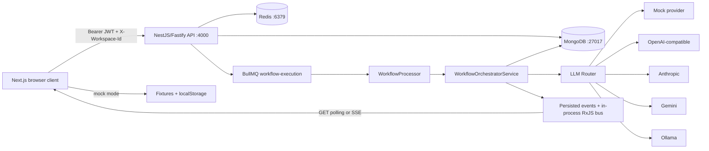

# A.L.F.R.E.D. Project Architecture and API Reference

Snapshot: 2026-06-06. This document describes the current working tree, including local uncommitted changes. Generated output (`node_modules`, `.next`, `backend/dist`) and secret values in `backend/.env` are intentionally excluded.

## 1. Product Purpose

A.L.F.R.E.D. is an agentic AI command center with two operating modes:

- **Mock mode**: the frontend uses local fixtures/localStorage and the backend LLM router uses deterministic mock model output.
- **API mode**: the Next.js frontend calls the NestJS backend. Data is scoped by authenticated user and active workspace.

The core product arc is:

1. A user registers or signs in.
2. Registration provisions a default workspace, mock provider/models, settings, and starter prompts.
3. The user creates a project.
4. The user defines and locks a requirement contract and project memory.
5. The user creates or edits a workflow DSL in Agent Studio.
6. Starting a run snapshots the requirement contract and workflow DSL.
7. BullMQ executes the workflow asynchronously.
8. Agent nodes call the selected LLM provider, while budgets, requirement drift, and critique issues are enforced.
9. Events, decisions, messages, issues, patches, usage, and artifacts are persisted.
10. Project detail and workflow-run pages aggregate and display the result.

## 2. Runtime Topology



### Main technologies

| Layer | Technology | Responsibility |
|---|---|---|
| Frontend | Next.js 14 App Router, React 18, TypeScript | Routes, shell, client interactions |
| State | Zustand 5 | Auth, workspace, projects, chats, models, workflows, settings, UI |
| UI | Tailwind CSS, Lucide, Framer Motion | Styling, icons, limited animation |
| Graph | `@xyflow/react` | Workflow editor and run graph |
| Charts | Recharts | Usage/dashboard visualization |
| Rich content | React Markdown, syntax highlighter | Chat output rendering |
| Backend | NestJS 10 on Fastify | REST API, auth, validation, business services |
| Validation | Zod | Request bodies and workflow DSL |
| Database | MongoDB 7 | Durable application state and event history |
| Queue | Redis 7 + BullMQ | Asynchronous workflow execution and run locks |
| Security | JWT, bcrypt, AES-256-GCM | Authentication, password hashing, provider-key encryption |

## 3. Ports, Modes, and Environment

| Service | Default |
|---|---|
| Frontend | `http://localhost:3000` |
| Backend | `http://localhost:4000` |
| Swagger, non-production only | `http://localhost:4000/docs` |
| MongoDB | `mongodb://localhost:27017/alfred` |
| Redis | `redis://localhost:6379` |

Frontend mode:

- `NEXT_PUBLIC_API_MODE=api` enables backend calls.
- Any other value uses mock/local mode.
- `NEXT_PUBLIC_API_BASE_URL` defaults to `http://localhost:4000`.

Backend mode:

- `LLM_MOCK_MODE=true` forces all model traffic through `MockLlmProvider`.
- Production requires strong `JWT_ACCESS_SECRET`, `JWT_REFRESH_SECRET`, `ENCRYPTION_KEY`, and `FRONTEND_URL`.
- Access-token TTL defaults to 15 minutes; refresh-token TTL defaults to 7 days.

## 4. Request and Response Lifecycle

### Frontend API client

`src/lib/api-client.ts` is the common transport:

1. Reads `alfred_access_token` from localStorage.
2. Reads the active 24-character Mongo workspace ID from `alfred_workspaces_state`.
3. Adds `Authorization: Bearer <token>` and `X-Workspace-Id`.
4. Uses an 8-second abort timeout.
5. Unwraps backend `{ data, meta }` envelopes.
6. Deduplicates identical concurrent GET requests.
7. Caches dashboard/usage GETs for 10 seconds and model/provider GETs for 30 seconds.
8. Clears all frontend GET cache entries after any mutation.

There is currently no automatic access-token refresh/retry path in the API client. `/auth/refresh` exists, but the browser services do not call it.

### Backend request pipeline

1. Fastify creates the request.
2. `RequestIdMiddleware` accepts `X-Request-Id` or creates a UUID and returns it in the response.
3. Fastify Helmet, CORS, and rate limiting run globally.
4. `JwtAuthGuard` validates protected requests and attaches `{ userId, email, role }`.
5. `WorkspaceScopeService` validates `X-Workspace-Id`; without it, the active/latest workspace is selected or created.
6. Zod pipes validate endpoint payloads where configured.
7. Services call repositories and serialize Mongo `_id`/dates for the API.
8. Success responses use `{ data, meta }`.
9. `GlobalExceptionFilter` returns `{ error: { code, message, details, requestId } }`.

## 5. Frontend Route Map

| Route | Main purpose | Data/state and when it is called |
|---|---|---|
| `/` | Entry redirect | Server redirects to `/dashboard`. |
| `/login` | Sign in | Submit calls auth store -> `POST /auth/login`; tokens are saved, then navigation continues. |
| `/signup` | Register | Submit calls auth store -> `POST /auth/register`; backend also provisions defaults. |
| `/dashboard` | Operational summary | On mount calls `GET /dashboard/summary`; mock dashboard fixtures remain for display fallbacks/details. |
| `/playground` | Chat workspace | On mount loads `GET /chats`; selecting a chat calls `GET /chats/:id/messages`; send calls `POST /chats/:id/messages`. |
| `/compare` | Parallel model comparison | User submits through `POST /llm/compare`; merged output can call `POST /artifacts`. |
| `/agent-studio` | Workflow DSL editor | On mount loads `GET /workflows`; save calls POST/PATCH workflow, validate calls `/validate`, run saves first if dirty then calls `/run`. |
| `/projects` | Project list/create | On mount calls `GET /projects`; create modal calls `POST /projects`; filtering is memoized client-side over loaded data. |
| `/projects/[id]` | Aggregated project command page | On mount calls only `GET /projects/:id/detail`; actions call workflow controls, requirement/memory saves, and artifact export. |
| `/workflows` | Workflow-run list | On mount calls `GET /workflow-runs`; API mode opens run detail rather than mutating mock state. |
| `/workflows/[id]/run` | Live run inspection/control | Initial call is `GET /workflow-runs/:id/detail`; events use EventSource-compatible service with polling fallback/reloads; pause/resume/stop call control APIs. |
| `/models` | Provider/model configuration | On mount loads providers and models in parallel; toggle/update calls PATCH; connection test calls provider test endpoint. |
| `/usage` | Cost/token analytics | On mount calls daily, by-provider, by-project, summary/alerts as needed; charts are dynamically loaded. |
| `/library` | Prompt library | On mount calls `GET /prompts`; create/edit/favorite calls prompt service; localStorage is fallback. |
| `/settings` | User application settings | Reads Zustand/localStorage; save uses `PATCH /settings` in API mode. |
| `/workspaces` | Workspace dashboard | Store hydration loads `GET /workspaces`; child actions create/switch/archive. |
| `/workspaces/new` | Workspace creation | Submit calls `POST /workspaces`, then switches active workspace. |
| `/workspaces/[id]/settings` | Workspace edit/archive/delete | Store actions call PATCH, switch, or DELETE. |
| `/profile` | User and aggregate profile metrics | Reads auth/project/chat/workflow/workspace stores; no dedicated profile mutation endpoint is wired. |
| `/account` | Account/session preferences | Reads auth/UI stores; logout calls `POST /auth/logout`. |
| `/billing` | Plan/budget presentation | Uses small billing mocks and active-workspace state; no billing backend exists. |
| `/keyboard-shortcuts` | Shortcut reference | Static UI only. |

## 6. Frontend State Ownership

| Store | Owns | Persistence/API behavior |
|---|---|---|
| `auth-store` | Current user, loading, auth errors | Calls auth service; tokens live in localStorage. |
| `workspace-store` | Workspace list, active ID, hydration | Mock state persists in `alfred_workspaces_state`; API mode synchronizes CRUD/switch. |
| `project-store` | Project list, tasks, project memory | API list/create through project service; small project mocks in mock mode. |
| `chat-store` | Chats, folders, active chat, messages | API loads lists/messages and creates chats; several folder/rename/move operations remain local UI state. |
| `model-store` | Providers, models, selected model | Parallel API load; updates are optimistic and fire API mutations. |
| `workflow-store` | Canonical editable DSL, selected node/edge, dirty/save/validation/run state | API workflow CRUD/validate/run; mock templates persist locally. |
| `settings-store` | Temperature, top-p, max tokens, budget rules | Persists to `alfred_settings`; settings page can sync generic settings API. |
| `ui-store` | Theme, sidebar, overlays, fullscreen, route loader | Theme/sidebar settings persist locally; domain data is not hydrated by the shell. |

### Mock/API boundary

The service layer decides mode with `isApiMode()`. UI pages should normally use stores/services rather than importing broad fixtures directly.

Current broad fixture coupling still exists in:

- `chat-service.ts` -> chat data from `src/lib/mock-data.ts`.
- `model-service.ts` -> provider/model data from `src/lib/mock-data.ts`.
- `workspace-service.ts` -> workspace data from `src/lib/mock-data.ts`.

Projects, project detail, workflows, usage, dashboard, prompts, billing, and compare have smaller domain mock modules.

## 7. Frontend Service Map

| Service | API-mode operations | Mock-mode source |
|---|---|---|
| `auth-service` | register, login, me, logout | Fixed mock user and mock tokens |
| `workspace-service` | list/get/create/update/switch/delete | `mock-data` + localStorage |
| `project-service` | list/get/create, overview, timeline, usage, detail, requirement, memory, issues, artifacts | `mocks/projects`, lazy `mocks/project-detail` |
| `chat-service` | chats/messages/branch, direct LLM chat/compare | `mock-data` chats + compare fixtures |
| `model-service` | providers/models, test provider, update provider/model | `mock-data` |
| `workflow-service` | workflow CRUD/validate/run, run detail/events/logs/issues/artifacts/control | `mocks/workflows` + localStorage |
| `workflow-events-service` | Authenticated run event stream/poll integration | No-op subscription |
| `artifact-service` | list/get/export/create | Lazy project-detail artifacts |
| `dashboard-service` | combined dashboard summary | Dashboard fixtures |
| `usage-service` | daily/grouped/summary/alerts | Usage fixtures |
| `prompt-service` | prompt list/get/save/favorite | Prompt fixtures |
| `settings-service` | prompts plus generic settings GET/PATCH | Prompt/usage fixtures |
| `mock-latency` | None | Small artificial delay for realistic local interactions |

## 8. Shell and Loading Arc

- `layout.tsx` applies global styles and mounts `AppInitializer` and `AppShell`.
- `AppInitializer` skips auth pages, hydrates workspaces, then calls `/auth/me`; unauthenticated API-mode users are redirected to `/login`.
- `AppShell` omits navigation on auth pages and changes overflow behavior for Playground/fullscreen routes.
- `AppSidebar` contains static navigation only. Chat store is dynamically imported only for New Chat.
- Command Palette is dynamically imported and mounted only while open.
- Workspace and user menu panels are split from their lightweight triggers.
- Sidebar usage details are dynamically imported.
- `Cmd/Ctrl+K` opens command search; `Cmd/Ctrl+N` creates a chat; Escape closes transient shell state.

## 9. Backend Module Responsibilities

| Module | Responsibility |
|---|---|
| Auth | Registration, login, access/refresh token issuance, logout, user projection, initial provisioning |
| Workspaces | User-owned workspace lifecycle and active-workspace selection |
| Projects | Project CRUD, pagination/search/filtering, aggregate detail, overview/timeline/usage/graph |
| Requirement Contracts | Versioned locked requirements and drift checks |
| Project Memory | Per-project durable bullets/files/context policy |
| Chats | Conversation CRUD, persisted messages, branch, regenerate, export |
| LLM Gateway | Direct chat, compare, and cost estimation |
| Model Providers | Encrypted provider credentials, health testing, provider resolution |
| AI Models | User model inventory and enablement/pricing/default-role settings |
| Workflows | Versioned DSL templates, validation, run creation |
| Workflow Runs | Run status, controls, graph reconstruction, issues/artifacts/logs/events/SSE |
| Orchestrator | DSL traversal, model execution, budgets, critique loop, artifacts, approvals |
| Queues | BullMQ producer and worker with Redis run lock |
| Usage | Usage event recording, counters, aggregates, cache, alerts |
| Artifacts | Artifact CRUD, immutable versions, export |
| Approvals | Human approval decisions and approval-resolved workflow events |
| Prompt Library | Workspace prompt CRUD and favorites |
| Settings | Generic per-user key/value settings |
| Dashboard | Cached combined project/run/usage/provider summary |
| Audit Logs | User audit history |
| Agent Nodes | Legacy/separate persisted node records for a workflow |
| Realtime | In-process RxJS publication of newly persisted workflow events |
| Health | MongoDB/Redis/API liveness/readiness |

## 10. Complete API Reference

Unless marked **Public**, endpoints require a bearer access token. **WS** means the operation is also scoped by the resolved `X-Workspace-Id`.

### Auth and user

| Method and path | Scope | Input / feature | Frontend caller and timing |
|---|---|---|---|
| `POST /auth/register` | Public | `{ name, email, password>=8 }`; creates user, tokens, and defaults | Signup form submit |
| `POST /auth/login` | Public | `{ email, password }`; verifies bcrypt hash and issues tokens | Login form submit |
| `POST /auth/refresh` | Public | `{ refreshToken }`; validates JWT and stored refresh hash, rotates tokens | Not currently called by frontend |
| `POST /auth/logout` | User | Clears stored refresh-token hash | Account logout/auth store |
| `GET /auth/me` | User | Safe current-user projection | App initialization after workspace hydration |
| `GET /users/me` | User | Alternate safe repository projection | No current frontend caller |

### Workspaces

| Method and path | Input / feature | Frontend caller and timing |
|---|---|---|
| `GET /workspaces?page&limit&includeArchived` | Paginated owned workspaces | Workspace-store API hydration |
| `POST /workspaces` | Name, description, plan/defaults/limits/theme/active | New-workspace submit |
| `GET /workspaces/:id` | One non-archived owned workspace | Service method; not a primary page load |
| `PATCH /workspaces/:id` | Partial workspace settings, including active/archived | Workspace settings edits |
| `DELETE /workspaces/:id` | Soft-archives workspace and selects replacement if needed | Archive/delete actions |
| `POST /workspaces/:id/switch` | Makes target active and others inactive | Workspace switcher |

### Projects, requirements, and memory

| Method and path | Scope | Input / feature | Frontend caller and timing |
|---|---|---|---|
| `GET /projects?page=1&limit=20&search&status&type` | WS | Escaped name/description search; max limit 100; `{ data, meta }` | `/projects` mount/store refresh |
| `POST /projects` | WS | `{ name, description?, type }`; creates planning project with zero usage | Project-create modal |
| `GET /projects/:id/detail` | WS | One aggregate: project, current contract, memory, latest 20 chats/runs/artifacts, active run, issues, latest 50 timeline, usage | `/projects/[id]` initial and post-action reload |
| `GET /projects/:id` | WS | Single project | Service utility; detail page uses aggregate instead |
| `PATCH /projects/:id` | WS | Name/description/type/status/progress | Available service/backend operation; list UI mainly updates local store |
| `DELETE /projects/:id` | WS | Hard delete of project record | No primary frontend action currently |
| `GET /projects/:id/overview` | WS | Project plus latest chats/runs/artifacts and open issue count | Legacy project-service overview path |
| `GET /projects/:id/timeline` | WS | Latest 50 project workflow events | Legacy project-service method; aggregate detail is preferred |
| `GET /projects/:id/usage` | WS | Usage grouped by source | Legacy project-service method; aggregate detail is preferred |
| `GET /projects/:id/graph-state` | WS | Latest run plus recent events | No current direct page caller |
| `POST /projects/:projectId/requirement-contracts` | WS | Creates versioned contract and sets active contract on project | Requirement card save when no contract exists |
| `GET /projects/:projectId/requirement-contracts/current` | WS | Current/latest contract | Service utility; aggregate detail already includes it |
| `PATCH /requirement-contracts/:id` | WS | Partial contract update; locked core fields reject incompatible changes | Requirement card save |
| `POST /requirement-contracts/:id/check-drift` | WS | `{ output }`; checks and records drift status/score | No current frontend caller |
| `GET /projects/:projectId/memory` | WS | Existing memory or clean default object | Service utility; aggregate detail includes memory |
| `PATCH /projects/:projectId/memory` | WS | Bullets/files/context policy | Project memory save |

### Chats and direct LLM

| Method and path | Scope | Input / feature | Frontend caller and timing |
|---|---|---|---|
| `GET /chats?page&limit&projectId` | WS | Paginated chats, optionally project-linked | Playground mount |
| `POST /chats` | WS | Title, project, mode, system prompt, generation settings | New Chat |
| `GET /chats/:id` | WS | One chat | Chat-service detail utility |
| `PATCH /chats/:id` | WS | Partial chat settings/title | Backend available; most rename/move UI remains local |
| `DELETE /chats/:id` | WS | Delete one chat | Backend available; current store delete is primarily local |
| `GET /chats/:chatId/messages?page&limit` | WS | Ordered persisted messages | Selecting/opening a chat |
| `POST /chats/:chatId/messages` | WS | Persists user message, calls LLM, persists assistant, records usage | Playground Send |
| `POST /chats/:chatId/branch` | WS | `{ fromMessageId }`; creates child chat and copies history through source | Branch message/chat action |
| `POST /chats/:chatId/regenerate` | WS | `{ messageId, providerType?, modelName? }`; reruns context | No current frontend caller |
| `POST /chats/:chatId/export` | WS | `{ format: markdown|json }` | No current frontend caller |
| `POST /llm/chat` | WS | Direct prompt/system/provider/model/temp/max tokens; records usage | Generic chat-service direct call |
| `POST /llm/compare` | WS | Prompt and 1-5 provider/model targets; executes in parallel, records each result | Compare page submit |
| `POST /llm/estimate-cost` | User | Estimates input/output tokens and configured rates | No current frontend caller |

### Providers and models

| Method and path | Scope | Input / feature | Frontend caller and timing |
|---|---|---|---|
| `GET /model-providers?page&limit` | User | Providers without encrypted key | Models page mount/model store |
| `POST /model-providers` | User | Provider type/name/base URL/API key/config; encrypts and masks key | Backend available; current page does not expose full create flow |
| `GET /model-providers/:id` | User | Safe provider projection | No primary caller |
| `PATCH /model-providers/:id` | User | Name/base URL/new key/enabled/config | Provider card changes |
| `DELETE /model-providers/:id` | User | Delete provider and audit | No primary caller |
| `POST /model-providers/:id/test` | User | Mock health or real minimal provider request; stores health state | Provider Test Connection |
| `GET /models?page&limit&providerId` | User | User model inventory | Models page mount/model store |
| `PATCH /models/:id` | User | Enabled, role, display name, input/output pricing | Model table changes |

Supported provider records include `mock`, `openai`, `anthropic`, `gemini`, `ollama`, `openrouter`, `groq`, `together`, and `custom_openai_compatible`. The active router implementation currently executes mock, OpenAI, Anthropic, Gemini, Ollama, and custom OpenAI-compatible providers; unsupported configured types fail cleanly.

### Workflows, runs, and agent nodes

| Method and path | Scope | Input / feature | Frontend caller and timing |
|---|---|---|---|
| `GET /workflows?page&limit&projectId` | WS | Workflow templates | Agent Studio mount |
| `POST /workflows` | WS | Name/description/project/DSL/max iterations/tokens/cost; default DSL if omitted | Save a new Agent Studio workflow |
| `GET /workflows/:id` | WS | Workflow template | Service utility |
| `PATCH /workflows/:id` | WS | Partial template; validates changed DSL and increments version | Save existing Agent Studio workflow |
| `DELETE /workflows/:id` | WS | Delete template | Backend available; no main page action |
| `POST /workflows/:id/validate` | WS | Optional replacement DSL; validates persisted or supplied DSL | Agent Studio Validate and post-save validation |
| `POST /workflows/:id/run` | WS | `{ projectId }`; snapshots DSL/contract, creates queued run, enqueues BullMQ job | Agent Studio Run and project Run Workflow |
| `GET /workflow-runs?page&limit&projectId` | WS | Paginated run list | `/workflows` mount; project helpers |
| `GET /workflow-runs/:id/detail` | WS | Combined run, graph state, logs, issues, artifacts | Run page initial/reload |
| `GET /workflow-runs/:id` | WS | One run | Service utility/store load |
| `POST /workflow-runs/:id/pause` | WS | Running -> paused | Run page/project detail Pause |
| `POST /workflow-runs/:id/resume` | WS | Paused/reviewable -> queued and enqueue resume job | Run page/project detail Resume |
| `POST /workflow-runs/:id/stop` | WS | Active run -> stopped | Run page/project detail Stop |
| `GET /workflow-runs/:id/graph-state` | WS | DSL nodes/edges, event-derived node status, totals/status | Service utility; detail endpoint preferred |
| `GET /workflow-runs/:id/logs?limit` | WS | Recent persisted events | Service utility; detail endpoint preferred |
| `GET /workflow-runs/:id/issues` | WS | Critique issues | Service utility and project issue helper |
| `GET /workflow-runs/:id/artifacts` | WS | Run artifacts | Service utility |
| `GET /workflow-runs/:id/events?limit&stream` | WS | JSON history or SSE history + live events + 25s heartbeat | Run event subscription/polling |
| `GET /agent-nodes/workflow/:workflowId` | User | Legacy node records by workflow | No current editor caller; canonical DSL is stored on workflow |
| `POST /agent-nodes/workflow/:workflowId` | User | Unvalidated body upsert for a legacy node record | No current frontend caller |
| `GET /agent-nodes/:id` | User | One legacy node record | No current frontend caller |
| `DELETE /agent-nodes/:id` | User | Delete legacy node record | No current frontend caller |

### Artifacts, approvals, prompts, settings, usage, audit, health

| Method and path | Scope | Input / feature | Frontend caller and timing |
|---|---|---|---|
| `GET /artifacts?page&limit&projectId&type` | WS | Paginated artifacts | Project/artifact services |
| `POST /artifacts` | WS | Title/type/content/project/metadata; creates version 1 | Compare merge or explicit artifact action |
| `GET /artifacts/:id` | WS | One artifact | Artifact open/service utility |
| `PATCH /artifacts/:id` | WS | Title/content/metadata; content creates next immutable version | No current primary edit UI |
| `DELETE /artifacts/:id` | WS | Delete artifact record | No current primary caller |
| `GET /artifacts/:id/versions` | WS | All versions ascending | No current primary caller |
| `GET /artifacts/:id/export?format` | WS | Markdown or JSON export | Project detail Export |
| `POST /artifacts/:id/export` | WS | Body-based equivalent export | No current frontend caller |
| `GET /approvals?page&limit&status` | User | Approval requests | No dedicated frontend approvals page |
| `GET /approvals/:id` | User | One approval | No current frontend caller |
| `POST /approvals/:id/approve` | User | Optional reason; resolves pending approval and emits event | No current frontend caller |
| `POST /approvals/:id/reject` | User | Optional reason; resolves pending approval and emits event | No current frontend caller |
| `GET /prompts?page&limit&category&favorite` | WS | Prompt library | Library/settings prompt load |
| `POST /prompts` | WS | Title/category/content/tags | Prompt editor/settings |
| `GET /prompts/:id` | WS | One prompt | Prompt service utility |
| `PATCH /prompts/:id` | WS | Partial prompt | Prompt editor |
| `DELETE /prompts/:id` | WS | Delete prompt | Settings/prompt service |
| `POST /prompts/:id/favorite` | WS | Toggle favorite | Prompt card |
| `GET /settings` | User | All key/value settings as one object | Settings load |
| `PATCH /settings` | User | Upserts every supplied key in parallel | Settings save |
| `GET /settings/:key` | User | One setting record | No current frontend caller |
| `PATCH /settings/:key` | User | `{ value }` upsert | No current frontend caller |
| `GET /usage/summary` | WS | Total input/output/tokens/cost | Usage page/sidebar/dashboard dependencies |
| `GET /usage/by-provider` | WS | Top 50 grouped cost/tokens | Usage page |
| `GET /usage/by-project` | WS | Top 50 grouped cost/tokens | Usage page |
| `GET /usage/by-model` | WS | Top 50 grouped cost/tokens | No current frontend chart |
| `GET /usage/daily` | WS | Last 90 daily points | Usage page |
| `GET /usage/budget-alerts` | WS | Fixed $100 monthly threshold alerts at 50/80/95% | Usage page/service |
| `GET /dashboard/summary` | WS | Cached project/run stats, usage, provider health | Dashboard mount |
| `GET /audit-logs?page&limit` | User | Reverse chronological audit records | No current frontend page |
| `GET /health` | Public | Mongo + Redis + API status | Operations/manual probes |
| `GET /health/ready` | Public | Dependency readiness boolean | Deployment readiness probe |
| `GET /health/live` | Public | Process liveness only | Deployment liveness probe |

## 11. Workflow DSL

Canonical shape:

```ts
{
  version: "1.0";
  name: string;
  nodes: WorkflowNode[];
  edges: WorkflowEdge[];
  stopConditions: {
    maxIterations: number;
    stopOnBudgetExceeded: boolean;
    stopOnRequirementDrift: boolean;
    stopOnUserStop: boolean;
  };
}
```

Supported node types:

`input`, `requirement_lock`, `ai_agent`, `consensus`, `critic`, `resolver`, `budget_gate`, `human_approval`, `final_output`, `codex_prompt_generator`, `export`.

Supported edge conditions:

- `has_issue_severity`: follows when the latest critic output contains a configured severity.
- `iteration_remaining`: follows while the current iteration is below the run maximum.
- `critic_approved`: follows when there are no blocking issues and the critic verdict is approved/non-blocking.
- `task_type_in`: follows when the requirement task type is in the configured values.

Validator invariants:

- Version must be `1.0`.
- At least two nodes.
- Node keys match lowercase alphanumeric/underscore and are unique.
- Every edge endpoint exists.
- Exactly one `requirement_lock`.
- Exactly one `final_output`.
- At least one `critic`.
- Iteration count is 1-20 in the DSL and 1-10 in workflow create/update limits.

Node UI position is stored under node config metadata so backend validation preserves it without treating it as execution logic.

## 12. Workflow Execution Arc

### Run creation

1. `POST /workflows/:id/run` verifies workflow and project in the active workspace.
2. Orchestrator loads current requirement contract in parallel.
3. DSL is validated.
4. A run is created with status `queued`, iteration 1, budget snapshot, requirement snapshot, and DSL snapshot.
5. `run.queued` is persisted and published.
6. BullMQ receives job ID equal to the run ID.

### Worker and concurrency

1. `WorkflowProcessor` consumes queue `workflow-execution` with concurrency 2.
2. It acquires Redis key `workflow-run-lock:<id>` with a random token and 900-second expiry.
3. A locked duplicate job is skipped.
4. The lock is removed by a compare-and-delete Lua script.
5. Resume jobs use a timestamped job ID so BullMQ accepts a new execution attempt.

### Node execution

1. Run status moves to `running`; started/running events are emitted.
2. Start node is `requirement_lock`, or the first node with no incoming edge.
3. Before each node, stop states are re-read from MongoDB.
4. Idempotency key is `<runId>:<nodeKey>:<iteration>`; completed execution is reused.
5. Project memory, open issues, prior outputs, requirement snapshot, workflow state, and budget form the agent context.
6. Prompt builder reinforces the locked motive and structured output.
7. Non-lock nodes estimate token/cost spend before the provider call.
8. Exhausted budget marks the run failed and emits budget/run failure events.
9. Provider output is parsed as raw JSON, fenced JSON, or a minimally repaired JSON object.
10. Execution, usage, agent message, optional consensus decisions, and status events are persisted.

### Critique and resolution loop

1. Critic output is parsed into verdict/issues/drift.
2. BLOCKER/HIGH issues become blocking.
3. Requirement drift creates a pending approval and moves the run to `needs_human_review`.
4. New critique issues are persisted once per run/iteration/source agent.
5. Resolver marks existing issues fixed and creates a revision patch.
6. `iteration_remaining` back-edge increments iteration.
7. At max iterations with unresolved blocking issues, an approval request is created.

### Completion and artifacts

- `final_output` creates one final artifact and version per run/type.
- `codex_prompt_generator` creates one `codex_prompt_bundle` and version.
- Artifact and version events are emitted.
- When no next edge remains after an artifact-producing node, run status becomes `completed`.

### Run controls

- Pause is observed between nodes because the orchestrator re-reads run state.
- Resume changes the status and enqueues a new job; execution idempotency prevents duplicate completed node work.
- Stop is terminal for the current processor loop.
- Events are first persisted, then published through the in-process bus.
- SSE subscribers receive persisted history first, then live in-process events. This bus is not cross-process Redis pub/sub, so multi-instance live delivery would need additional infrastructure.

## 13. LLM Routing and Provider Keys

Provider resolution:

1. Mock mode or explicit `providerType=mock` always uses the mock provider.
2. If provider type is absent but model name is present, the user model inventory is searched.
3. Ollama resolves an optional user-configured base URL and needs no API key.
4. Remote providers resolve the newest enabled user provider record.
5. Encrypted API key is decrypted only inside the concrete provider.
6. Provider errors expose status-oriented messages, not raw response secrets.

Provider implementations:

- OpenAI: `/chat/completions`, bearer key.
- Custom OpenAI-compatible: OpenAI request format with configurable/default local base URL.
- Anthropic: `/v1/messages`, `x-api-key`, version header.
- Gemini: `:generateContent`, key query parameter.
- Ollama: `/api/chat`, local base URL.
- Mock: deterministic JSON by node role and iteration, including a critique/fix/approval arc.

Actual remote-provider `costUsd` is currently returned as zero by adapters; pricing fields exist on models, but real-call cost calculation is not yet integrated into each provider response.

## 14. MongoDB Collections and Relationships

| Collection | Main role and links |
|---|---|
| `users` | Identity, password hash, refresh-token hash |
| `workspaces` | User-owned tenant boundary and defaults |
| `projects` | Workspace project, status/progress, aggregate usage counters, active requirement ID |
| `requirement_contracts` | Versioned project requirement and drift state |
| `project_memory` | Unique user/project memory document |
| `model_providers` | User provider configuration and encrypted key |
| `ai_models` | User model catalog and pricing/config |
| `chats` | Workspace/project conversation metadata and branching parent |
| `messages` | Ordered chat turns |
| `prompt_library` | Workspace prompt templates |
| `workflows` | Workspace/project workflow DSL template and version |
| `workflow_runs` | Immutable snapshots plus mutable run status/usage/current node |
| `agent_nodes` | Legacy separate workflow node records |
| `agent_executions` | One node attempt/output, idempotency key |
| `agent_messages` | Agent-to-run proposal/critique messages |
| `agent_decisions` | Consensus decisions |
| `critique_issues` | Critic findings and resolution status |
| `revision_patches` | Resolver output by iteration |
| `workflow_events` | Append-oriented event timeline used for graph reconstruction |
| `usage_events` | Per-call provider/model/tokens/cost/latency/source |
| `artifacts` | Current artifact record and current version pointer |
| `artifact_versions` | Immutable artifact snapshots |
| `approval_requests` | Human decisions for drift/review gates |
| `audit_logs` | Security/business audit entries |
| `settings` | Unique user/key generic setting |

Important indexes:

- Unique user email.
- Unique project memory by user/project.
- Unique sparse agent-execution idempotency key.
- Unique settings by user/key.
- Compound user/workspace indexes for all principal tenant resources.
- Workflow event run/time ordering.
- Usage event user/workspace/time aggregation.
- Prompt text index over title/content/tags.

## 15. Security and Isolation

- Passwords use bcrypt with cost 12.
- Refresh tokens are stored as bcrypt hashes, not plaintext.
- Provider keys use AES-256-GCM with random 12-byte IV and authentication tag.
- API responses omit password hashes, refresh hashes, and encrypted API keys.
- Pino redacts authorization, passwords, API keys, and tokens.
- All main project/workspace resources are filtered by `userId + workspaceId`.
- Cross-user and cross-workspace isolation have dedicated e2e coverage.
- CORS allows no-origin requests, localhost development origins, and configured frontend URL.
- Global rate limit is 120 requests/minute.
- Swagger is disabled in production.

Known boundary exceptions:

- Settings, provider/model inventory, approvals, audit logs, and legacy agent-node APIs are user-scoped rather than workspace-scoped.
- Legacy agent-node POST accepts an unvalidated body.
- In-memory dashboard/usage caches are process-local.

## 16. Caching and Performance

- Frontend GET request deduplication prevents duplicate concurrent fetches.
- Frontend dashboard/usage cache: 10 seconds.
- Frontend model/provider cache: 30 seconds.
- Backend usage aggregate cache: 10 seconds per user/workspace/scope.
- Backend dashboard summary cache: 10 seconds per user/workspace.
- Project detail performs independent aggregate reads with `Promise.all`.
- Project detail limits chats/runs/artifacts to 20 and timeline to 50.
- Project list defaults to 20 and caps at 100.
- Command Palette, workspace/user menu panels, sidebar usage, workflow graph, and heavy chart/message content use dynamic loading in relevant routes.

## 17. Test Strategy and Commands

Root commands:

| Command | Purpose |
|---|---|
| `npm run dev` | Next.js development server |
| `npm run dev:all` | Start Mongo/Redis, backend watch server, and frontend |
| `npm run build` | Production Next.js build and route bundles |
| `npm run build:backend` | NestJS compile |
| `npm run typecheck` | Strict frontend TypeScript |
| `npm run lint` | Next.js ESLint |
| `npm run test:frontend` | Lightweight deterministic file/helper/editor checks |
| `npm run test:backend` | Backend Jest unit tests |
| `npm run test:e2e` | Start infra, then backend Jest HTTP/integration e2e |
| `npm run test:browser` | Playwright browser suite |
| `npm run seed` | Backend seed script |
| `npm run indexes` | Ensure MongoDB indexes |

Backend coverage includes:

- Budget thresholds and spend decisions.
- Encryption and key masking.
- Production secret guard.
- Mock and real-provider routing behavior.
- Structured output parsing and requirement drift.
- DSL validation, edge selection, traversal, state machine.
- Full HTTP workflow execution through BullMQ.
- Project detail aggregation.
- Multi-user and multi-workspace isolation.
- Default user provisioning.

## 18. Complete Annotated File Structure

### Root

| File | Responsibility |
|---|---|
| `.env.local.example` | Frontend API-mode/base-URL example |
| `.eslintrc.json` | Next.js lint configuration |
| `.gitattributes`, `.gitignore`, `gitignore` | Repository text/ignore rules |
| `README.md` | Setup, commands, product overview |
| `package.json`, `package-lock.json` | Frontend/root dependencies and scripts |
| `next.config.mjs`, `next-env.d.ts` | Next.js build and generated type setup |
| `tsconfig.json`, `tsconfig.tsbuildinfo` | Strict frontend TypeScript and incremental metadata |
| `tailwind.config.ts`, `postcss.config.js` | Styling pipeline |
| `docker-compose.yml` | MongoDB and Redis development services |
| `index.html` | Legacy/static root HTML artifact; Next.js uses App Router |
| `playwright.config.ts` | Mock-mode browser test configuration |
| `playwright.api.config.ts` | API-mode browser test configuration |
| `public/favicon.svg` | Browser icon |
| `scripts/dev-infra.js` | Checks ports, starts existing containers or Compose services |
| `scripts/frontend-checks.mjs` | Route existence and pure helper/workflow editor checks |
| `docs/PROJECT_ARCHITECTURE.md` | This reference |

### Frontend routes

| File | Responsibility |
|---|---|
| `src/app/layout.tsx` | Root metadata/styles/initializer/shell |
| `src/app/globals.css` | Theme tokens, Tailwind layers, shared visual utilities |
| `src/app/page.tsx` | Root redirect |
| `src/app/login/page.tsx`, `signup/page.tsx` | Authentication forms |
| `src/app/dashboard/page.tsx` | Summary metrics, activity, provider health, quick actions |
| `src/app/playground/page.tsx` | Mounts the full chat workspace |
| `src/app/compare/page.tsx` | Multi-model compare and merge-to-artifact |
| `src/app/agent-studio/page.tsx` | Canonical workflow DSL editor orchestration |
| `src/app/projects/page.tsx` | Search/filter/view/create project list |
| `src/app/projects/[id]/page.tsx` | Combined backend-driven project detail and actions |
| `src/app/workflows/page.tsx` | Workflow run catalog |
| `src/app/workflows/[id]/run/page.tsx` | Live run graph, events, issues, artifacts, controls |
| `src/app/models/page.tsx` | Provider and model management |
| `src/app/usage/page.tsx` | Usage/cost metrics and charts |
| `src/app/library/page.tsx` | Prompt search/editor/favorites |
| `src/app/settings/page.tsx` | Model-generation, appearance, security, shortcut settings |
| `src/app/workspaces/page.tsx` | Workspace dashboard |
| `src/app/workspaces/new/page.tsx` | Workspace creation |
| `src/app/workspaces/[id]/settings/page.tsx` | Workspace edit/lifecycle |
| `src/app/profile/page.tsx` | User/workspace aggregate profile |
| `src/app/account/page.tsx` | Account/session settings |
| `src/app/billing/page.tsx` | Mock plan/provider-cost/budget view |
| `src/app/keyboard-shortcuts/page.tsx` | Static shortcut reference |

### Layout and shared UI

| File/group | Responsibility |
|---|---|
| `components/layout/AppInitializer.tsx` | Auth and workspace bootstrapping |
| `AppShell.tsx` | Route shell, keyboard listeners, loader, dynamic palette |
| `AppSidebar.tsx` | Navigation, dynamic New Chat, menus, usage card |
| `TopBar.tsx` | Current no-op compatibility component |
| `UserMenu.tsx`, `UserMenuPanel.tsx` | Lightweight trigger and deferred account menu |
| `WorkspaceSwitcher.tsx`, `WorkspaceSwitcherPanel.tsx` | Lightweight active-workspace trigger and deferred switcher |
| `SidebarUsageCard.tsx` | Sidebar usage summary |
| `PageHeader.tsx`, `RightPanel.tsx`, `Sidebar.tsx` | Reusable/legacy layout surfaces |
| `components/shared/AiPageLoader.tsx` | Route/action loading overlay |
| `AppLink.tsx` | Shell-aware Next link |
| `Button.tsx`, `IconButton.tsx` | Command controls |
| `CommandPalette.tsx` | Deferred route command search |
| `ConfirmDialog.tsx` | Confirmation modal |
| `EmptyState.tsx`, `Skeleton.tsx` | Empty/loading presentation |
| `GlassCard.tsx`, `MetricCard.tsx` | Reusable content/metric containers |
| `PopoverMenu.tsx`, `Tooltip.tsx` | Overlay primitives |
| `SearchInput.tsx`, `SegmentedControl.tsx` | Search and mode controls |
| `StatusBadge.tsx` | Normalized status presentation |
| `FullScreenToggle.tsx` | Route fullscreen state control |

### Domain components

| Directory/files | Responsibility |
|---|---|
| `components/chat/ChatComposer.tsx`, `ChatPane.tsx`, `ChatHistoryList.tsx` | Base chat composition/history layouts |
| `CodeBlockHighlighter.tsx`, `MarkdownMessageContent.tsx`, `LightMessageContent.tsx` | Deferred rich message rendering paths |
| `MessageBubble.tsx` | Message actions, content, metrics |
| `FileAttachmentPreview.tsx`, `ModelPicker.tsx`, `SuggestionChips.tsx`, `TokenFooter.tsx` | Chat controls and metadata |
| `components/playground/PlaygroundLayout.tsx` | Responsive conversation/workspace composition |
| `ConversationSidebar.tsx`, `ConversationTabs.tsx` | Chat/project navigation |
| `ChatWorkspace.tsx`, `ChatHeader.tsx`, `ChatMessages.tsx` | Active conversation surface |
| `ChatComposer.tsx`, `ChatComposerControls.tsx` | Playground send/mode/provider/settings behavior |
| `ChatHistoryGroupedList.tsx`, `ProjectChatTree.tsx`, `ChatFolderPanel.tsx` | Grouped and project/folder browsing |
| `CompactModelSelector.tsx`, `ModeSelector.tsx`, `AgentActionsDropdown.tsx` | Provider/model/mode/agent controls |
| `ArtifactOpenButton.tsx`, `MoveChatToFolderDialog.tsx` | Artifact and organization actions |
| `components/compare/CompareGrid.tsx`, `ModelResponsePane.tsx` | Parallel response panes |
| `components/dashboard/ActivityTimeline.tsx`, `MiniUsageChart.tsx`, `ProviderHealthCard.tsx`, `QuickActionCard.tsx`, `StatCard.tsx` | Dashboard display modules |
| `components/projects/ProjectCard.tsx`, `ProjectTable.tsx`, `ProjectDateFilters.tsx` | Project collection views |
| `RequirementContractCard.tsx`, `ProjectMemoryPanel.tsx` | Editable requirement and memory |
| `CritiquePanel.tsx`, `ArtifactPanel.tsx`, `ExecutionTimeline.tsx` | Aggregated project execution output |
| `ProjectTaskDashboard.tsx` | Deferred list-page task summary panel |
| `components/workflow/WorkflowGraph.tsx` | React Flow graph/edit interaction |
| `NodePropertiesPanel.tsx` | Selected DSL node/edge properties and conditions |
| `WorkflowCanvasToolbar.tsx` | Add/save/validate/run/reset/delete/fit/export controls |
| `WorkflowStatusBar.tsx` | Dirty/save/validation status |
| `AgentNodeCard.tsx` | Custom workflow node rendering |
| `BudgetMeter.tsx`, `TokenCostMeter.tsx` | Run budget/usage visualization |
| `components/models/ProviderCard.tsx`, `ModelTable.tsx`, `ApiKeyInputMasked.tsx` | Provider/model settings |
| `components/library/PromptCard.tsx`, `PromptEditorModal.tsx`, `PromptLibraryGrid.tsx` | Prompt library CRUD UI |
| `components/usage/BudgetAlert.tsx`, `BudgetProgress.tsx`, `CostBreakdownChart.tsx`, `UsageChart.tsx` | Usage and budget presentation |
| `components/settings/KeyboardShortcutsPanel.tsx`, `SecuritySettingsPanel.tsx`, `SettingsSection.tsx`, `SliderSetting.tsx`, `ToggleSetting.tsx` | Settings controls |
| `components/workspaces/WorkspaceDashboard.tsx`, `WorkspaceSwitcher.tsx` | Workspace management content |

### Frontend libraries, mocks, services, stores, and types

| File | Responsibility |
|---|---|
| `src/lib/api-client.ts` | Authenticated workspace-aware transport/cache |
| `adapters.ts` | Data-shape adapter helpers |
| `cost.ts` | Cost calculation helpers |
| `date-groups.ts` | Conversation date grouping |
| `markdown.ts` | Markdown/code content helpers |
| `theme-utils.ts` | Theme persistence and cycling |
| `utils.ts` | Class merging and formatting |
| `workspace-utils.ts` | Pure workspace create/update/select helpers |
| `workflow-editor.ts` | Pure DSL add/edit/connect/delete/position/validate/serialize helpers |
| `types.ts` | Shared frontend domain models |
| `src/types/workflow-dsl.ts` | Canonical editable workflow DSL types |
| `src/lib/mock-data.ts` | Remaining broad chats/models/providers/workspaces fixtures |
| `mocks/projects.ts`, `project-detail.ts` | Small project collection/detail fixtures |
| `mocks/workflows.ts` | Workflow/run/node fixtures |
| `mocks/dashboard.ts`, `usage.ts`, `billing.ts` | Operational and cost fixtures |
| `mocks/prompts.ts`, `compare.ts` | Prompt and comparison fixtures |
| `src/services/*.ts` | Mode-aware domain boundaries described in section 7 |
| `src/store/*.ts` | Zustand ownership described in section 6 |

### Backend root, common, config, contracts, database, security

| File/group | Responsibility |
|---|---|
| `backend/package.json`, `package-lock.json` | Backend dependencies/scripts |
| `.env.example` | Backend environment contract; `.env` is local secret/runtime configuration |
| `docker-compose.yml` | Backend-local Mongo/Redis compose alternative |
| `nest-cli.json`, `tsconfig.json`, `tsconfig.build.json`, `eslint.config.js` | Nest build, TS, and lint configuration |
| `src/main.ts` | Fastify bootstrap, security plugins, errors, Swagger, listen |
| `src/app.module.ts` | Global module graph and request-ID middleware |
| `common/decorators/current-user.decorator.ts` | Reads guard-attached request user |
| `common/guards/jwt-auth.guard.ts` | Bearer access-token verification |
| `common/middleware/request-id.middleware.ts` | Request correlation |
| `common/pipes/zod-validation.pipe.ts` | Zod -> standardized 400 |
| `common/filters/global-exception.filter.ts` | Standard error envelope |
| `common/types/request-user.ts` | Authenticated request-user type |
| `common/utils/object-id.ts`, `pagination.ts` | Mongo ID serialization/conversion and pagination helpers |
| `config/app.config.ts`, `auth.config.ts`, `budget.config.ts`, `llm.config.ts`, `mongodb.config.ts`, `redis.config.ts` | Environment normalization |
| `config/production-secret.guard.ts` | Production startup secret policy |
| `contracts/api-response.types.ts` | Success/list envelopes |
| `contracts/workflow-dsl.types.ts`, `workflow-event.types.ts`, `agent-context.types.ts` | Backend workflow contracts |
| `database/database.service.ts`, `database.module.ts`, `mongo.types.ts` | Mongo connection and typed collection access |
| `database/index-definitions.ts`, `indexes.service.ts`, `create-indexes.ts` | Index definitions/startup/manual creation |
| `database/seed.ts` | Development seed |
| `security/encryption.service.ts` | AES-256-GCM provider-key encryption |
| `security/api-key-masker.ts`, `redaction.util.ts` | Safe display and logging |
| `security/security.module.ts` | Encryption provider export |

### Backend LLM, orchestration, queue, and repositories

| File/group | Responsibility |
|---|---|
| `llm/interfaces/llm-provider.interface.ts`, `llm.types.ts` | Provider contract and chat input/output |
| `llm/llm-router.service.ts` | Mode/provider/model/key resolution |
| `llm/providers/openai.provider.ts` | OpenAI Chat Completions adapter |
| `anthropic.provider.ts` | Anthropic Messages adapter |
| `gemini.provider.ts` | Gemini Generate Content adapter |
| `ollama.provider.ts` | Ollama chat adapter |
| `custom-openai.provider.ts` | Configurable OpenAI-compatible adapter |
| `mock.provider.ts` | Deterministic local agent/chat outputs |
| `http-provider.utils.ts` | URL, JSON, status, token-estimate helpers |
| `orchestrator/default-workflow.dsl.ts` | Default eight-node agent loop |
| `workflow-dsl.validator.ts` | Zod and graph invariants |
| `workflow-orchestrator.service.ts` | Complete run traversal and persistence |
| `workflow-context-builder.service.ts` | Requirement/run/budget/memory context |
| `agent-prompt-builder.service.ts` | Locked-goal prompt construction |
| `structured-output-parser.service.ts` | JSON extraction/repair |
| `requirement-drift.service.ts` | Deterministic drift detection |
| `critique-resolution.service.ts`, `workflow-state-machine.ts` | Blocking issue and transition helpers |
| `orchestrator.module.ts` | Orchestrator dependency registration |
| `queues/workflow.queue.ts` | BullMQ producer |
| `queues/workflow.processor.ts` | Worker and Redis lock |
| `queues/queues.module.ts` | Queue provider registration |
| `repositories/base.repository.ts` | Shared owned/workspace CRUD and serialization |
| `repositories/repositories.module.ts` | Registers/exports all repositories |
| `users.repository.ts`, `workspaces.repository.ts`, `projects.repository.ts` | Principal identities/tenants/projects |
| `requirement-contracts.repository.ts`, `project-memory.repository.ts` | Project context |
| `model-providers.repository.ts`, `ai-models.repository.ts` | LLM inventory |
| `chats.repository.ts`, `messages.repository.ts` | Conversations |
| `prompts.repository.ts`, `settings.repository.ts` | User/workspace configuration |
| `workflows.repository.ts`, `workflow-runs.repository.ts`, `workflow-events.repository.ts` | Workflow definitions, state, timeline |
| `agent-nodes.repository.ts`, `agent-executions.repository.ts`, `agent-messages.repository.ts`, `agent-decisions.repository.ts` | Agent graph/execution records |
| `critique-issues.repository.ts`, `revision-patches.repository.ts`, `approval-requests.repository.ts` | Governance and resolution |
| `artifacts.repository.ts`, `artifact-versions.repository.ts` | Outputs and versions |
| `usage-events.repository.ts`, `audit-logs.repository.ts` | Metering and audit |

### Backend feature modules

Each feature directory contains a Nest module plus the controller/service listed below:

| Directory | Files and role |
|---|---|
| `modules/auth` | `auth.controller`, `auth.service`, `auth.schemas`, `user-provisioning.service`, `auth.module` |
| `modules/workspaces` | `workspaces.controller/service/module`, `workspace-scope.service` |
| `modules/projects` | `projects.controller/service/module` |
| `modules/requirement-contracts` | Contract controller/service/module |
| `modules/project-memory` | Memory controller/module; repository-backed controller logic |
| `modules/chats` | Chat controller/service/module |
| `modules/llm-gateway` | Direct LLM controller/module |
| `modules/model-providers` | Provider controller/service/module |
| `modules/ai-models` | Model controller/service/module |
| `modules/workflows` | Workflow template controller/service/module |
| `modules/workflow-runs` | Run query/control/stream controller/service/module |
| `modules/agent-nodes` | Legacy node controller/service/module |
| `modules/budget` | Budget calculation service/module |
| `modules/usage` | Usage aggregation controller/service/module |
| `modules/artifacts` | Artifact/version controller/service/module |
| `modules/approvals` | Approval controller/service/module |
| `modules/prompt-library` | Prompt controller/service/module |
| `modules/settings` | Generic settings controller/service/module |
| `modules/dashboard` | Combined summary controller/service/module |
| `modules/audit-logs` | Audit list controller/module |
| `modules/users` | Current-user controller/module |
| `modules/realtime` | RxJS event bus service/module |
| `modules/health` | Health controller/module |

### Tests

| File | Coverage |
|---|---|
| `backend/test/budget.service.spec.ts` | Cost/snapshot/spend thresholds |
| `encryption.service.spec.ts` | Encryption randomness/decryption/key masking |
| `production-secret.guard.spec.ts` | Production configuration rejection |
| `mock-llm.provider.spec.ts` | Deterministic mock outputs |
| `llm-router.service.spec.ts` | Provider routing, keys, base URLs, errors |
| `requirement-drift.service.spec.ts` | Drift detection |
| `structured-output-parser.spec.ts` | Raw/fenced/repaired JSON |
| `workflow-dsl.validator.spec.ts` | DSL schema and invariants |
| `workflow-dsl-executor.spec.ts` | Start/edges/conditions/traversal helpers |
| `workflow-state-machine.spec.ts` | Critic/budget transitions |
| `vertical-slice.e2e.spec.ts` | Service-level integrated workflow slice |
| `http-vertical-slice.e2e.spec.ts` | HTTP auth/provider/project/workflow/detail/usage/artifact arc |
| `multi-user-isolation.e2e.spec.ts` | Cross-user access isolation |
| `workspace-isolation.e2e.spec.ts` | Same-user cross-workspace isolation and provisioning |
| `jest-e2e.json` | E2E Jest transform/root/test pattern |
| `tests/browser/auth-flow.spec.ts` | Browser authentication |
| `tests/browser/playground-smoke.spec.ts` | Playground interaction smoke |
| `tests/browser/route-smoke.spec.ts` | Route rendering smoke |
| `tests/browser-api/api-mode-smoke.spec.ts` | Browser API-mode integration smoke |

## 19. Current Functional Boundaries

Fully backend-driven core paths:

- Authentication and provisioning.
- Workspace lifecycle and scope.
- Project list and combined project detail.
- Requirement contracts and project memory.
- Workflow template save/validate/run.
- Workflow run execution/control/detail/events.
- Chat send and compare.
- Provider/model settings.
- Usage, artifacts, prompts, dashboard summary.

Still mock-first or partially local:

- Billing has no backend.
- Profile/account edits are mostly local presentation.
- Chat folders and some conversation organization operations are local only.
- Dashboard and usage retain small display fallbacks.
- Approvals and audit APIs have no dedicated frontend management pages.
- Agent-node CRUD is legacy; Agent Studio persists nodes/edges inside workflow DSL.
- Remote provider pricing is not applied to returned cost.
- Access-token refresh is not automatically invoked.

## 20. Practical End-to-End Call Examples

### Create and run a project workflow

1. `POST /projects`
2. `POST /projects/:id/requirement-contracts`
3. `PATCH /projects/:id/memory`
4. `POST /workflows`
5. `POST /workflows/:id/validate`
6. `POST /workflows/:id/run`
7. BullMQ executes asynchronously.
8. `GET /workflow-runs/:runId/detail` and/or `/events?stream=true`
9. `GET /projects/:projectId/detail`
10. `GET /artifacts/:artifactId/export?format=markdown`

### Playground chat

1. `GET /chats`
2. `POST /chats` if a new conversation is requested
3. `GET /chats/:id/messages`
4. `POST /chats/:id/messages`
5. Backend persists user turn -> calls provider -> records usage -> persists assistant turn
6. UI appends normalized returned messages

### Workspace switch

1. `POST /workspaces/:id/switch`
2. Store persists new active ID.
3. Subsequent API client requests send the new `X-Workspace-Id`.
4. Domain lists reload in the selected workspace when their pages mount/refresh.
